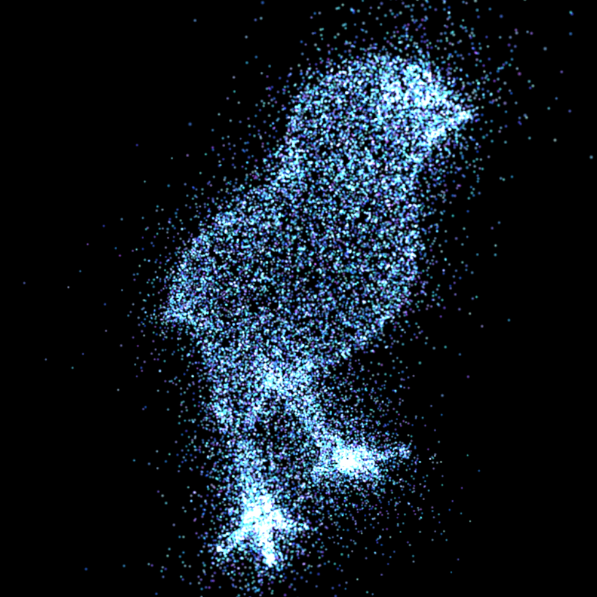

# Project 6: Particle System - Life and the Bird

Wanru Zhao, 59981278

Generated a city of desert using shape grammar.

Demo: https://wanruzhao.github.io/homework-6-particle-system-WanruZhao/

======

## Interactive forces
  - Uncheck CameraMove to enable attract and repel force
  - Left click - attract
  - Right click - repel
  
## Auto play
  - Keep CameraMove checked and check Autoplay to enable random scene
  - Can change mesh at the same time
  - Different operation will result in different movement
  - Totally random scene
  
## Mesh
  - Bird and pumpkin
  

## Reference

Background music: Life and the bird - The Cinematic Orchestra
